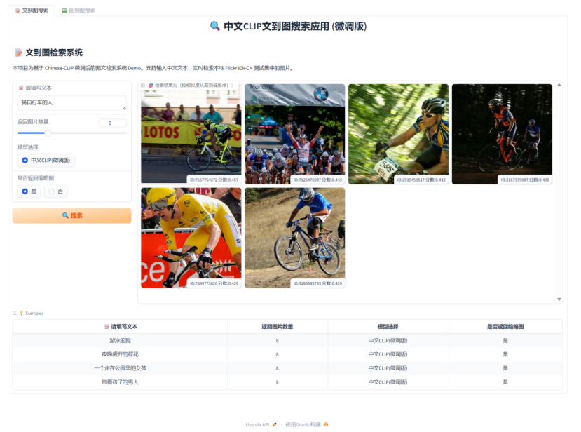

# 基于 Chinese-CLIP 的图文检索系统 (ChineseCLIP Search System)

## 📷 系统演示

### 文搜图检索



### 图搜图检索


> 本项目为2025年人工智能导论课课程设计作业，基于 Chinese-CLIP 微调实现双向图文检索功能（文搜图 + 图搜图）。

## ✨ 功能特性

- 🔍 **文搜图检索**：输入中文文本，检索相似图片
- 🖼️ **图搜图检索**：上传查询图片，检索视觉相似图片
- ⚡ **快速推理**：使用 ONNX Runtime 加速文本编码
- 🎨 **友好界面**：基于 Gradio 的 Web 交互界面
- 📊 **模型微调**：在 Flickr30k-CN 数据集上微调，检索准确率提升至 84.10%

## 🎯 在线演示

运行以下命令启动应用：

```bash
python app.py
```

访问 `http://127.0.0.1:7860` 即可使用。

## 📁 项目结构

```
ChineseCLIP_Search_System/
├── app.py                      # 主应用入口（双Tab界面）
├── text2image.py              # 文搜图界面
├── image2image.py             # 图搜图界面
├── utils.py                   # 核心检索功能
├── build_db.py                # 构建图像特征库
├── export_onnx.py             # 导出 ONNX 模型
├── plot_log.py                # 绘制训练曲线
├── run_finetune.py            # 微调脚本
├── report_*.png               # 训练过程可视（3张）
├── datapath/                  # 数据目录
│   ├── datasets/              # 数据集（需自行准备）
│   ├── experiments/           # 训练输出
│   └── pretrained_weights/    # 预训练权重
└── image/                     # README 图片资源

# 需要自行下载的大文件（见下方说明）：
# - clip_cn_vit-b-16.pt        # 预训练模型权重（718MB）
# - vit-b-16-text.onnx         # 文本编码器 ONNX（390MB）
# - image_features.json        # 图像特征库（10MB）
```

## 🚀 快速开始

### 1. 环境配置

```bash
# 克隆仓库
git clone https://github.com/your-username/ChineseCLIP_Search_System.git
cd ChineseCLIP_Search_System

# 安装依赖
pip install -r requirements.txt

# 克隆并安装 Chinese-CLIP（必需，提供 cn_clip 包）
git clone https://github.com/OFA-Sys/Chinese-CLIP.git
cd Chinese-CLIP
pip install -e .
cd ..
```

### 2. 下载必要文件

由于 GitHub 限制，以下大文件需要手动下载：

| 文件 | 大小 | 下载链接 | 说明 |
|------|------|----------|------|
| `clip_cn_vit-b-16.pt` | 718MB | [官方链接](https://clip-cn-beijing.oss-cn-beijing.aliyuncs.com/checkpoints/clip_cn_vit-b-16.pt) | 预训练权重 |
| `datapath/experiments/flickr30k_finetune_pycharm/checkpoints/epoch_latest.pt` | - | 自行训练或联系作者 | 微调后的权重 |
| Flickr30k-CN 数据集 | - | [数据集说明](#数据集准备) | 测试集图片 |

**放置位置：**
- 将 `clip_cn_vit-b-16.pt` 放在项目根目录
- 将微调权重放在 `datapath/experiments/flickr30k_finetune_pycharm/checkpoints/` 下
- 数据集放在 `datapath/datasets/Flickr30k-CN/` 下

### 3. 生成必要文件

```bash
# 导出 ONNX 文本编码器（用于加速推理）
python export_onnx.py

# 构建图像特征库（预计算所有图片的特征向量）
python build_db.py
```

### 4. 启动应用

```bash
python app.py
```

## 📊 数据集准备

本项目使用 Flickr30k-CN 数据集（中文版 Flickr30K）：

```
datapath/datasets/Flickr30k-CN/
├── train_imgs.tsv          # 训练集图片（id + base64）
├── train_texts.jsonl       # 训练集文本（id + caption + image_ids）
├── test_imgs.tsv           # 测试集图片（1000张，用于检索库）
├── test_texts.jsonl        # 测试集文本
└── lmdb/                   # LMDB 格式数据（用于训练）
    ├── train/
    └── valid/
```

**数据格式转换：**

如果您有原始的图文对数据，需要转换为上述格式：

```bash
# 使用 Chinese-CLIP 提供的脚本
cd Chinese-CLIP
python cn_clip/preprocess/build_lmdb_dataset.py \
    --data_dir ../datapath/datasets/Flickr30k-CN \
    --splits train,valid
```

## 🏋️ 模型微调（可选）

如果您想重新训练模型：

```bash
cd Chinese-CLIP

# 下载预训练权重到 ../datapath/pretrained_weights/
# 修改 run_scripts/flickr30k_finetune_vit-b-16_rbt-base.sh 中的数据路径

# 开始微调
bash run_scripts/flickr30k_finetune_vit-b-16_rbt-base.sh ../datapath
```

**训练结果：**
- Epoch 1: Text→Image Recall@10 = 73.44%
- Epoch 2: Text→Image Recall@10 = 80.95%
- Epoch 3: Text→Image Recall@10 = 84.10% ✅

可视化训练曲线：

```bash
python plot_log.py
```

## 🔧 核心技术

### 文搜图流程
1. **文本编码**：使用 ONNX 优化的 RoBERTa-wwm-ext-base 编码中文查询
2. **特征匹配**：计算文本特征与预计算图像特征的余弦相似度
3. **Top-K 检索**：返回相似度最高的 K 张图片

### 图搜图流程
1. **图像编码**：使用微调后的 ViT-B/16 编码查询图片
2. **特征匹配**：与图像特征库计算余弦相似度
3. **Top-K 检索**：返回视觉相似的图片

### 关键代码

**文搜图核心函数** ([utils.py:269-314](utils.py#L269-L314))：
```python
def clip_api(text, return_n, model_name, thumbnail):
    # 1. 文本编码（ONNX）
    text_input = clip.tokenize([text]).numpy()
    text_feat = session.run(["unnorm_text_features"], {"text": text_input})[0]
    text_feat = text_feat / np.linalg.norm(text_feat, axis=1, keepdims=True)

    # 2. 相似度计算
    logits = text_feat @ img_feats_matrix
    probs = logits[0]

    # 3. Top-K 排序
    top_indices = np.argsort(probs)[-return_n:][::-1]
    return results
```

**图搜图核心函数** ([utils.py:221-264](utils.py#L221-L264))：
```python
def image_search_api(query_img, return_n, model_name, thumbnail):
    # 1. 图像编码
    query_feat = encode_query_image(query_img)

    # 2. 相似度计算
    logits = query_feat @ img_feats_matrix
    probs = logits[0]

    # 3. Top-K 排序
    top_indices = np.argsort(probs)[-(return_n+5):][::-1]
    return results
```

## 📈 实验结果

### 微调效果对比

| 模型 | Text→Image R@1 | Text→Image R@5 | Text→Image R@10 |
|------|----------------|----------------|-----------------|
| 原始 CLIP | ~15% | ~35% | ~45% |
| 微调后 (Epoch 3) | 68.4% | 80.1% | **84.1%** |

### 检索相似度分析

- **文搜图**：余弦相似度通常在 0.4-0.5 之间（跨模态检索）
- **图搜图**：余弦相似度通常在 0.6-0.99 之间（同模态检索）

> **注意**：0.4+ 在跨模态检索中已经是很高的相似度，因为文本和图像在语义空间中天然存在差异。

## 🛠️ 依赖项

主要依赖包：

```
gradio>=3.50.0
torch>=1.12.0
onnxruntime-gpu>=1.15.0  # 或 onnxruntime（CPU版本）
pillow>=9.0.0
numpy>=1.21.0
pandas>=1.3.0
cn_clip  # 从 Chinese-CLIP 安装
```

完整依赖见 `requirements.txt`


## 注意🤝 

本项目是课程设计作业，只是学习和课程作业使用Chinese-CLIP 开发，遵循了其开源协议。

## 🙏 致谢

本项目在开发过程中参考和借鉴了以下优秀的开源项目：

- **[sugarandgugu/Text2Image-Retrieval](https://github.com/sugarandgugu/Text2Image-Retrieval)**：本项目的主要参考实现，提供了基于 Chinese-CLIP 的文搜图系统框架
- [Chinese-CLIP](https://github.com/OFA-Sys/Chinese-CLIP)：提供预训练模型和训练框架
- [Flickr30k-CN](https://github.com/li-xirong/cross-lingual-cap)：提供中文图文数据集
- [Gradio](https://gradio.app/)：提供 Web 界面框架

特别感谢 [@sugarandgugu](https://github.com/sugarandgugu) 的开源项目，为本课程设计提供了宝贵的参考和学习资源。在此基础上，我们实现了图搜图功能，优化了界面设计，并完成了系统的微调和部署。


**⭐ 如果这个项目对您有帮助，欢迎 Star！**
